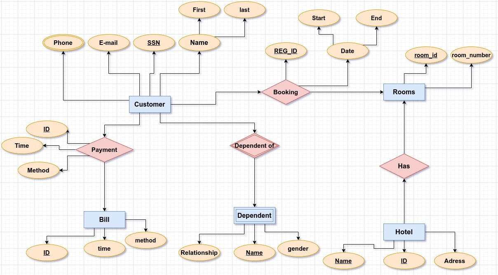

# Hotel System ERD
Simple Hotel DataBase management system (ERD).

## Description:
The details of Hotel is store into the Hotel tables respective with all tables
Each entity (Customers, Services, Booking, Rooms, Hotel) contains primary key and unique keys. 
The entity Booking has binded with Hotel, Rooms entities with foreign key
There is one-to-one and one-to-many relationships available between Booking, Payments, Customers, Hotel.

#### Hotel Management System entities and their attributes:
Hotel Entity : Attributes of Hotel are hotel id, name,hotel address.
Rooms Entity : Attributes of Rooms are room id, room_number.
Bill Entity : Attributes of Payments are payment id, payment date, payment method.
Customers Entity : Attributes of Customers are customerid, customer name, customer email.
Dependent Entity : Attributes of dependent are  dependent name, dependent gender , dependent relationship.

#### ER (Entity Relationship) Diagram:
represents the model of Hotel Management System Entity. The entity-relationship diagram of the Hotel Management System shows all the visual instruments of database tables and the relations between Rooms, Payments, Hotel, Customers etc. It used structure-data and to define the relationships between structured data groups of Hotel Management System functionalities. The main entities of the Hotel Management System are Hotel, Rooms, Services, Payments, Booking and Customers.

